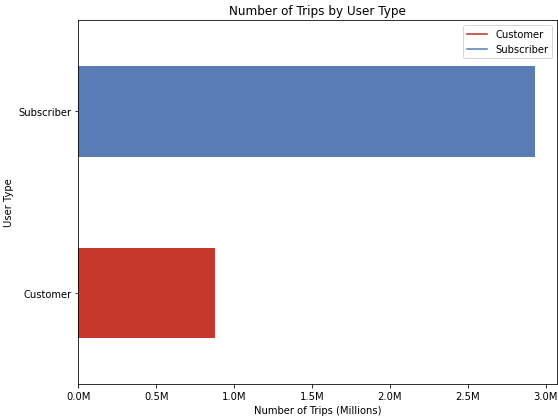
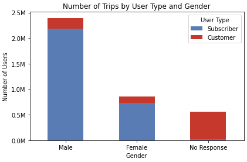
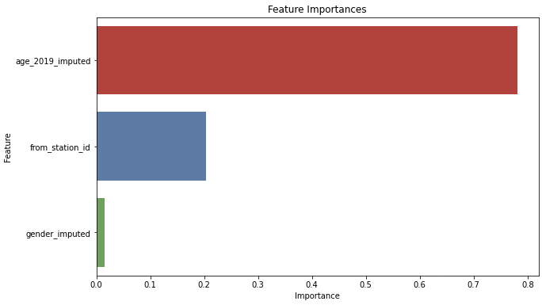

    

# Chicago Divvy/Lyft Bicycle Subscriber Analysis
### Author: [Sean Harris](https://www.linkedin.com/in/sean-harris-data-sci-and-finance/)
### Note: This is for academic purposes only.

August 22, 2023

* [Presentation](https://github.com/smharris312/Divvy_Chicago_Data_Analysis/blob/main/Chicago%20Lyft%20Divvy%20Presentation.pdf)

# Business Understanding

## Stakeholders:
* Chicago Department of Transportation
* Lyft/Divvy

## Background:
[Construction on the I-90/Kennedy Expressway in Chicago](https://www.nbcchicago.com/traffic/years-long-construction-project-begins-monday-kennedy-expressway/3098384/) has broken ground on a multiyear construction project to rehabilitate the bridge structures, road surface and modernize the signage. The $150 million project is focused on a 7.5 mile stretch leading into the downtown loop and is expected to be completed in the summer of 2025. Since the project has begun, [traffic congestion has diverted to surface streets leading to gridlock](https://www.cbsnews.com/chicago/news/kennedy-construction-trickle-down-traffic-jams/).

## Goal:
Using public Lyft/Divvy ride data, this analysis will develop a model to accurately predict Divvy Subscribers in order to inform marketing decisions aimed at increasing riders and reducing surface street traffic congestion.

# Data Overview

The dataset used for this analysis is publicly available on the [City of Chicago Data portal](https://data.cityofchicago.org/Transportation/Divvy-Trips/fg6s-gzvg).

#### Features of Interest:

 * from_station_id - the station that the ride was initiated from
 * gender - Male/Female/No Response                   
 * age_2019 - age of the rider in 2019

#### Target:         
 * user_type - Subscriber equals 1 and Customer equals 0           

#### Data Limitations:
* Only includes 2019 data
* Missing data for age and gender 
* Target variable is imbalanced favoring Subscribers


* Gender data is imbalanced


## Model Interpretation
Grid search was used to run two models with various parameters to determine the best model. The best performing model was the Decision Tree. The training data Decision Tree had a recall score of 0.84 compared to the Logistic Regression model that had a recall score of 0.71. The key metric for this analysis is recall because that will minimize the false negatives and maximize the true positives which will give us better performance on predicting Divvy Subscribers. The Decision Tree ran faster than the Logistic Regression and had better performance across all metrics. The most important feature in determining a Subscriber is by far the riders age which accounts for 78.1% of feature importance.



After training the model on the train data the overall recall improved and the model correctly identifies Subscribers 87.12% of the time. This is a first pass and we will need to add additional features and run more complex models to see if we can improve recall performance.


## Recommendations
* Implement marketing plan to highlight Divvy in the downtown area.
* Offer discount rates to downtown offices.
* Highlight safe bike paths.


## Next Steps
* Run additional models with hardware that has adequate processing.
* Develop heat map of Chicago showing Divvy rides
* Expand the data set to include recent data.
* Analyze app reviews for consumer sentiment.
* Perform straw poll regarding Divvy safety sentiment.
* Evaluate station and bicycle conditions.

```
├── images
├── .gitignore
├── Chicago Lyft Divvy Presentation.pdf
├── Chicago_Lyft_Divvy_Ride_Analysis.ipynb
└── README.md
```


